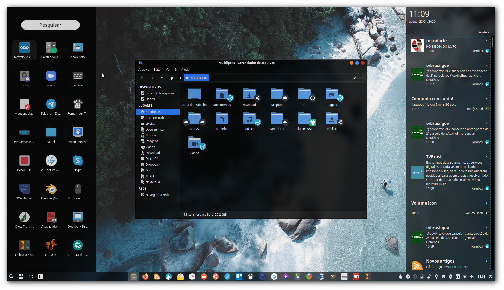

## Bem vindo!

Esta documentação contém scripts de personalização otimizados para o [**Xubuntu**](https://xubuntu.org) [**20.04**](https://xubuntu.org/release/20-04/).

Saiba mais sobre os scripts através das postagens nesse [**blog**](https://blog.rauldipeas.tk/xfscripts).

## Instalação

**Você pode seguir a ordem recomendada de execução dos scripts, através do arquivo de [pós instalação](postinst.md)**.

Para uma execução correta dos scripts, você deve copiar e colar uma linha por vez no terminal, para poder acompanhar detalhadamente o processo, dessa forma, qualquer tipo de problema pode ser detectado com maior facilidade.

Porém, se você quiser rodar de forma automatizada, pode instalar o [**Bashrun**](./bashrun.md), que permite a execução dos scripts ao clicar no botão _**Run**_.

## Envolva-se

Crie um [_**fork**_](https://github.com/rauldipeas/xfscripts) e envie um _**pull-request**_ com as suas sugestões de melhorias para este repositório, elas são muito bem vindas!

Acompanhe as atualizações do projeto através do canal no [**Telegram**](https://t.me/xfscripts) e do [**Mastodon**](https://mastodon.social/@raul_dipeas).

<!-- Load Facebook SDK for JavaScript -->

<!-- Your customer chat code -->

