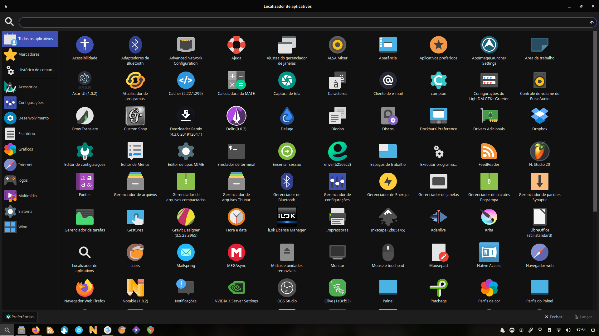
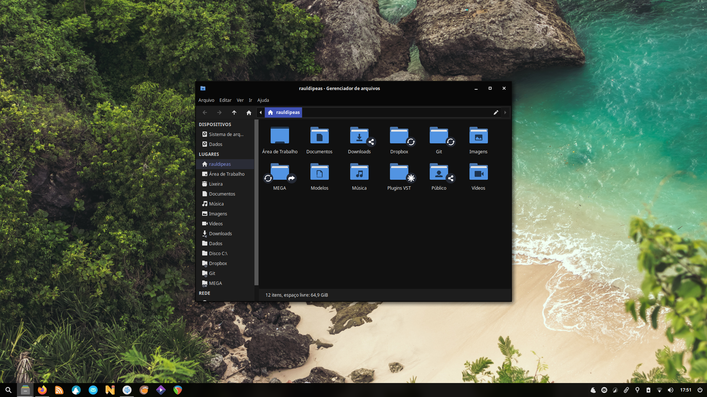

# Script de pós instalação do Xubuntu 19.10
 - [**Bash-it**](scripts/bash-it.md) (_workflow_)
 - [**XanMod**](scripts/xanmod.md) (_workflow_)
 - [**ALSA firmware**](scripts/alsa-firmware.md) (_workflow_)
 - [**NVIDIA PPA**](scripts/nvidia-ppa.md) (_extras_)
 - [**NVIDIA DRM modeset**](scripts/nvidia-drm-modeset.md) (_workflow_)
 - [**GRUB**](scripts/grub.md) (_desktop_)
 - [**JACK**](scripts/jack.md) (_studio_)
 - [**WINE**](scripts/wine.md) (_studio_)
 - [**REAPER**](scripts/reaper.md) (_studio_)
 - [**!** Resolve](scripts/resolve.md) (_studio_)
 - [**OpenShot**](scripts/openshot.md) (_studio_)
 - [**Blender**](scripts/blender.md) (_studio_)
 - [**Gestos**](scripts/gestures.md) (_workflow_)
 - [**Detecção de palma da mão**](scripts/palmdetection.md) (_workflow_)
 - [**Rolagem natural**](scripts/natural-scrolling.md) (_workflow_)
 - [**XCape**](scripts/xcape.md) (_workflow_)
 - [**Rofi**](scripts/rofi.md) (_workflow_)
 - [**Skippy-XD**](scripts/skippy-xd.md) (_workflow_)
 - [**Central de notificações**](scripts/deadd-notification-center.md) (_desktop_)
 - [**DockbarX**](scripts/dockbarx.md) (_desktop_)
 - [**Debs**](scripts/debs.md) (_miscelânea_)
 - [**Apt**](scripts/apt.md) (_miscelânea_)
 - [**Temas**](scripts/style.md) (_desktop_)
 - [**LightDM webkit2 greeter**](scripts/lightdm-webkit2-greeter.md) (_desktop_)
 - [**Painel**](scripts/panel.md) (_desktop_)
 - [**Compton**](scripts/compton.md) (_desktop_)
 - [**Lutris**](scripts/lutris.md) (_games_)
 - [**MellowPlayer**](scripts/mellowplayer.md) (_extras_)
 - [**QOwnNotes**](scripts/qownnotes.md) (_extras_)
 - [**Syncthing**](scripts/syncthing.md) (_extras_)
 - [**Google Drive**](scripts/google-drive.md) (_extras_)
 - [**VSCodium**](scripts/vscodium.md) (_extras_)
 - [**CleanUp**](scripts/uninstall-duplicity.md) (_extras_)

#### Desktop

#### Apps

#### Terminal

#### Arquivos
