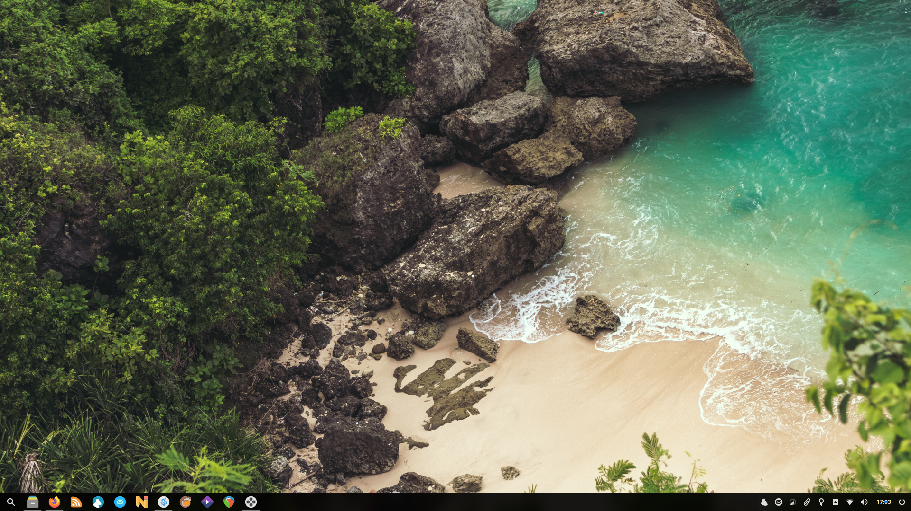
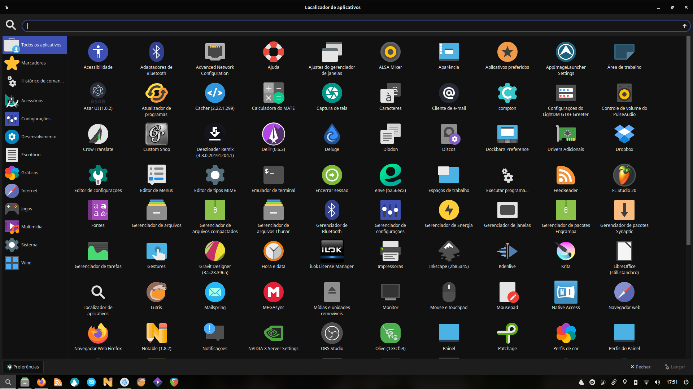
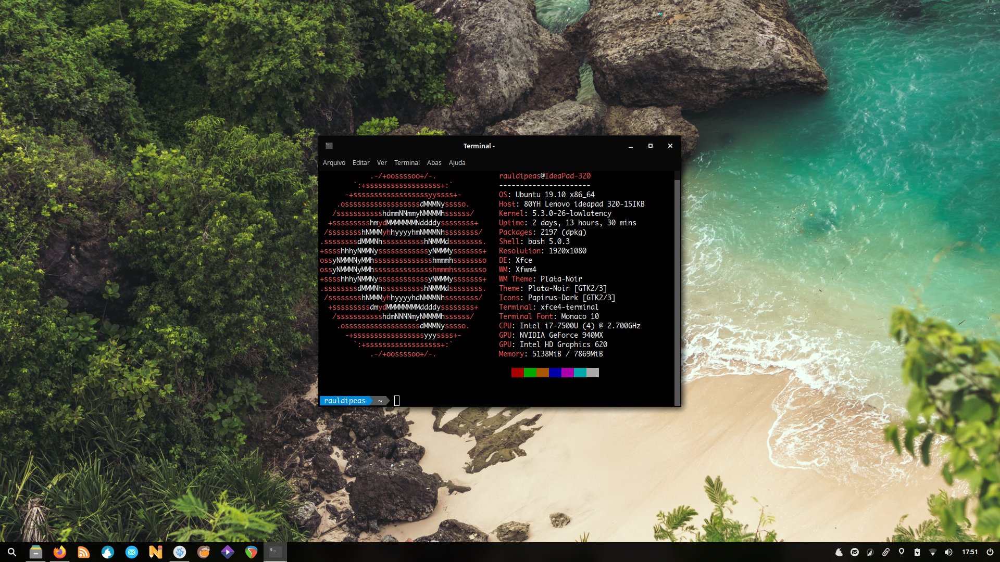
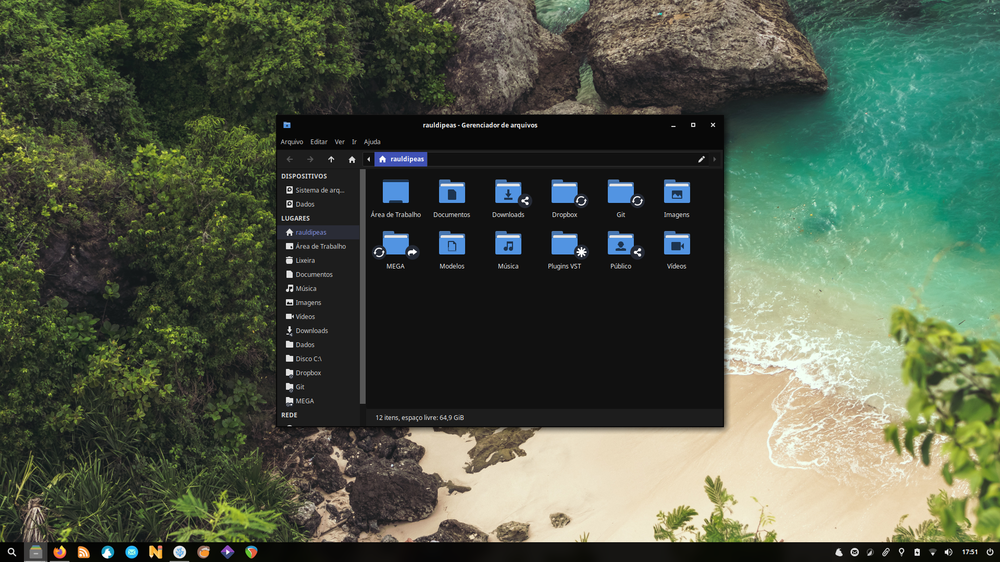

# Script de póst instalação do Xubuntu 19.10
 - [**Bash-it**](scripts/bash-it.md)
 - [**Kernel de baixa latência**](scripts/lowlatency-kernel.md)
 - [**NVIDIA DRM modeset**](scripts/nvidia-drm-modeset.md)
 - [**JACK**](scripts/jack.md) (_studio_)
 - [**WINE**](scripts/wine.md) (_studio_)
 - [**REAPER**](scripts/reaper.md) (_studio_)
 - [**Resolve**](scripts/resolve.md) (_studio_)
 - [**Gestos**](scripts/gestures.md) (_workflow_)
 - [**Rolagem natural**](scripts/natural-scrolling.md) (_workflow_)
 - [**XCape**](scripts/xcape.md) (_workflow_)
 - [**DockbarX**](scripts/dockbarx.md) (_desktop_)
 - [**Painel**](scripts/panel.md) (_desktop_)
 - [**Compton**](scripts/compton.md) (_desktop_)
 - [**Temas**](scripts/style.md) (_desktop_)
 - [**Debs**](scripts/debs.md)
 - [**Apt**](scripts/apt.md)
 - [**Lutris**](scripts/lutris.md) (_games_)
 - [**Xubuntu extras**](scripts/xubuntu-extras.md) (_extras_)
 - [**Elementary OS AppCenter repo**](scripts/eos-appcenter-repo.md) (_extras_)
#### Desktop

#### Apps

#### Terminal

#### Arquivos
