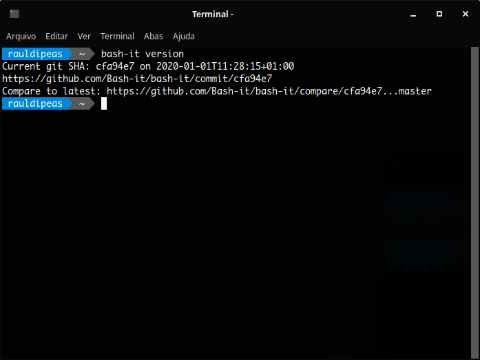

# Bash-it
```bash
sudo apt update
sudo apt install -y git fonts-powerline undistract-me
mkdir -pv ~/.fonts
wget -cO ~/.fonts/Monaco-Linux.ttf https://github.com/hbin/top-programming-fonts/raw/master/Monaco-Linux.ttf
wget -c https://github.com/ryanoasis/nerd-fonts/releases/download/v2.0.0/DroidSansMono.zip
unzip DroidSansMono.zip -d ~/.fonts
rm -rfv DroidSansMono.zip
fc-cache -fv
git clone --depth=1 https://github.com/Bash-it/bash-it.git ~/.bash_it
bash ~/.bash_it/install.sh --silent
sed -i 's/bobby/powerline/g' ~/.bashrc
echo '
# Undistract-me
. /usr/share/undistract-me/long-running.bash
notify_when_long_running_commands_finish_install' >> ~/.bashrc #manual-cleanup-on-reinstall
echo "
# Autocompletar pelo histórico
bind '\"\\e[A\": history-search-backward'
bind '\"\\e[B\": history-search-forward'" >> ~/.bashrc #manual-cleanup-on-reinstall
sudo sed -i 's/took/levou/g' /usr/share/undistract-me/long-running.bash
sudo sed -i 's/dialog-information/xterm/g' /usr/share/undistract-me/long-running.bash
sudo sed -i 's/Long\ command\ completed/Comando\ concluído\!/g' /usr/share/undistract-me/long-running.bash
echo DPkg::Post-Invoke \{\"sed -i \'s/took/levou/g\' /usr/share/undistract-me/long-running.bash\"\;\}\; | sudo tee /etc/apt/apt.conf.d/100undistract-me
echo DPkg::Post-Invoke \{\"sed -i \'s/dialog-information/xterm/g\' /usr/share/undistract-me/long-running.bash\"\;\}\; | sudo tee -a /etc/apt/apt.conf.d/100undistract-me
echo DPkg::Post-Invoke \{\"sed -i \'s/Long\ command\ completed/Comando\ concluído\!/g\' /usr/share/undistract-me/long-running.bash\"\;\}\; | sudo tee -a /etc/apt/apt.conf.d/100undistract-me
sed -i 's/apt-get/apt/g' ~/.bash_it/aliases/available/apt.aliases.bash
sed -i 's/ -V//g' ~/.bash_it/aliases/available/apt.aliases.bash
sed -i 's/remove --purge/autoremove --purge/g' ~/.bash_it/aliases/available/apt.aliases.bash
mkdir -pv ~/.config/xfce4/terminal
echo '[Configuration]
FontName=Monaco 10
MiscDefaultGeometry=85x25
DropdownHeight=70
DropdownWidth=70
DropdownOpacity=90
DropdownKeepAbove=FALSE
ScrollingOnOutput=FALSE
BackgroundMode=TERMINAL_BACKGROUND_TRANSPARENT
BackgroundDarkness=0,930000' > ~/.config/xfce4/terminal/terminalrc
exit
```
[](br:bash-it)

#### APT alias:
```bash
bash_it enable alias apt
exit
```
[](br:bash-it_apt-alias)

