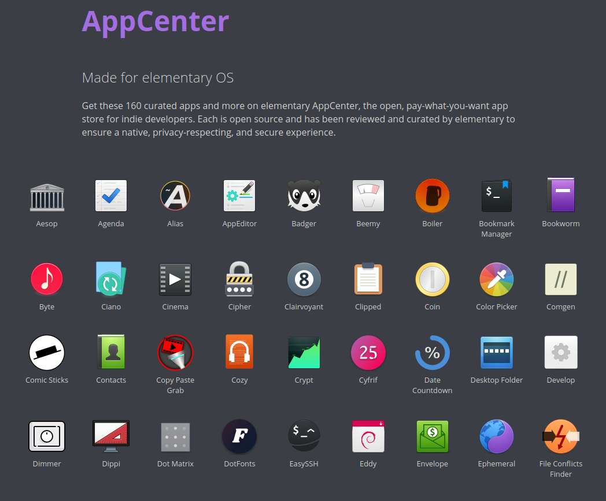

# Elementary OS AppCenter repo
```bash
wget -O- http://packages.elementary.io/key.asc | gpg --dearmor | sudo tee /etc/apt/trusted.gpg.d/appcenter.gpg
echo 'deb http://packages.elementary.io/appcenter bionic main' | sudo tee /etc/apt/sources.list.d/appcenter.list
aptupd
```
[**AppCenter**](https://appcenter.elementary.io/)

