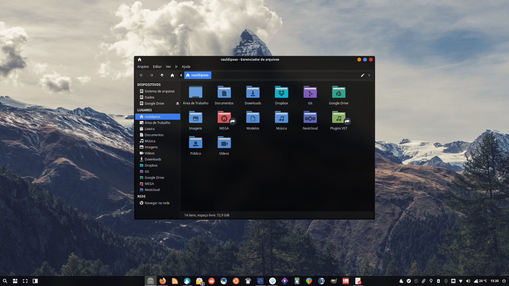

 # Ícones de pasta
```bash
aptinst -y librsvg2-bin
sudo wget -O /usr/share/thumbnailers/folder.thumbnailer http://my.opendesktop.org/s/72T6aimS5dWikL6/download #update-link
gef http://my.opendesktop.org/s/jbtRBMTc2bJeFAQ/download /usr/bin/folder-thumbnailer #update-link
mkdir -pv ~/.config/Thunar
wget -O ~/.config/Thunar/uca.xml http://my.opendesktop.org/s/887f3rPPZyAbqLs/download #update-link
```
[](br:folder-icon)

