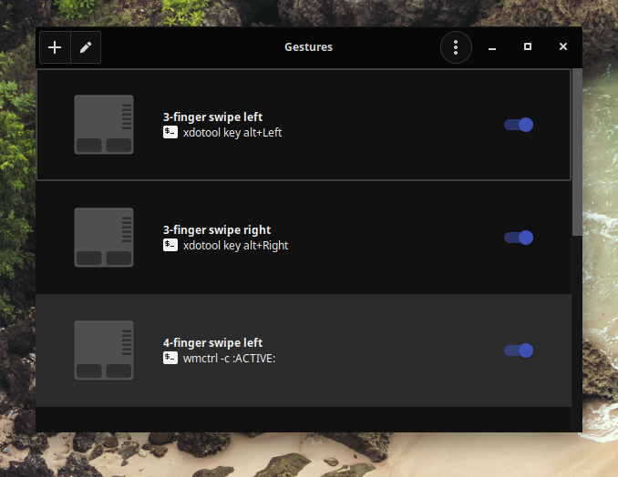

# Gestos
#### [checkinstall-build](http://my.opendesktop.org/index.php/s/i5g8XbQiAfmGWtj/download)
```bash
sudo gpasswd -a $USER input
aptinst -y libinput-tools
git clone https://github.com/bulletmark/libinput-gestures.git
cd libinput-gestures
sudo make install #checkinstall
libinput-gestures-setup autostart
sed -i 's/NoDisplay/#NoDisplay/g' ~/.config/autostart/libinput-gestures.desktop
aptinst -y python-gobject python3 python3-gi python3-setuptools wmctrl xdotool
git clone https://gitlab.com/cunidev/gestures
cd gestures
sudo python3 setup.py install
cd ../..
sudo rm -rfv libinput-gestures* /usr/share/applications/libinput-gestures.desktop
sudo sed -i 's/org.cunidev.gestures/libinput-gestures/g' /usr/share/applications/org.cunidev.gestures.desktop
echo '# Swipe threshold (0-100)
swipe_threshold 100
# Gestures
gesture pinch in 2 wmctrl -r :ACTIVE: -b remove,maximized_vert,maximized_horz
gesture pinch out 2 wmctrl -r :ACTIVE: -b add,maximized_vert,maximized_horz
gesture swipe left 3 xdotool key alt+Left
gesture swipe right 3 xdotool key alt+Right
gesture swipe left 4 wmctrl -c :ACTIVE:
gesture swipe up 3 xdotool key Super_L+s
gesture swipe down 3 xdotool getactivewindow windowminimize' > ~/.config/libinput-gestures.conf
```
[](br:gestures)

