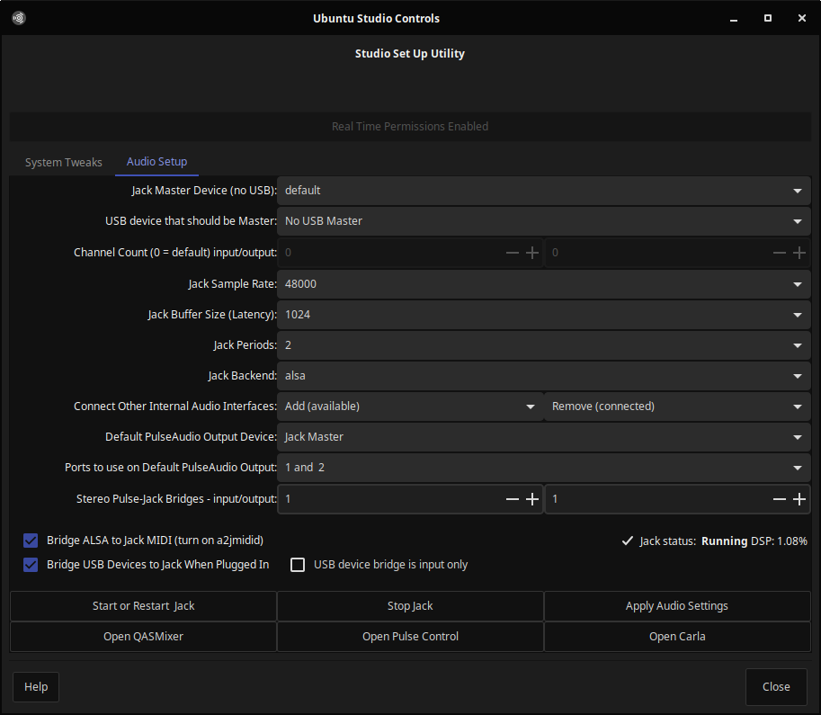

# JACK
```bash
sudo usermod -aG audio $USER
sudo usermod -aG video $USER
echo jackd2 jackd/tweak_rt_limits string true | sudo debconf-set-selections
#sudo add-apt-repository ppa:ubuntustudio-ppa/backports
aptinst -y --no-install-recommends ubuntustudio-controls
sudo sed -i 's/256/224/g' /usr/share/ubuntustudio-controls/ubuntustudio-controls.glade
echo DPkg::Post-Invoke \{\"sed -i \'s/256/224/g\' /usr/share/ubuntustudio-controls/ubuntustudio-controls.glade\"\;\}\; | sudo tee /etc/apt/apt.conf.d/100ubuntustudio-controls
mkdir -pv ~/.config/autostart ~/.config/qastools
wget -O ~/.config/qastools/qasmixer.conf http://my.opendesktop.org/s/Cb8QQ9jjk3no52r/download
echo '[Desktop Entry]
Type=Application
Terminal=false
Name=ALSA Restore
Exec=sh -c "sleep 2;alsactl restore --file ~/.config/asound.state"' | tee ~/.config/autostart/alsa-restore.desktop
alsactl store --file ~/.config/asound.state
```
[](br:jack)

