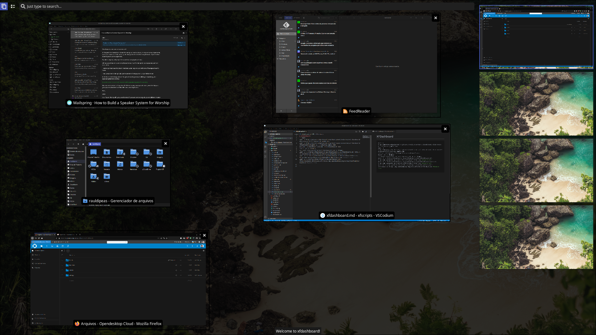

# XFDashboard
```bash
wget -c http://mirrors.edge.kernel.org/ubuntu/pool/universe/x/xfdashboard/xfdashboard_0.7.7-0ubuntu1_amd64.deb
wget -c http://mirrors.edge.kernel.org/ubuntu/pool/universe/x/xfdashboard/xfdashboard-plugins_0.7.7-0ubuntu1_amd64.deb
aptinst -y ./xfdashboar*.deb;rm -rfv xfdashboard*.deb
mkdir -pv ~/.themes/
cp -varf /usr/share/themes/xfdashboard-blue ~/.themes
wget -O ~/.themes/xfdashboard-blue/xfdashboard-1.0/xfdashboard.xml http://my.opendesktop.org/s/TMt7jjEM5JG9J2i/download #update-link
wget -O ~/.themes/xfdashboard-blue/xfdashboard-1.0/xfdashboard-blue.css http://my.opendesktop.org/s/WHYwWwCmAmQNqL5/download #update-link
wget -O ~/.config/xfce4/xfconf/xfce-perchannel-xml/xfce4-keyboard-shortcuts.xml http://my.opendesktop.org/s/x6LP7Cs5foxmF5G/download #update-link
wget -O ~/.config/xfce4/xfconf/xfce-perchannel-xml/xfdashboard.xml http://my.opendesktop.org/s/z9wM75YJFGzQfYo/download #update-link

```
[](br:xfdashboard)

