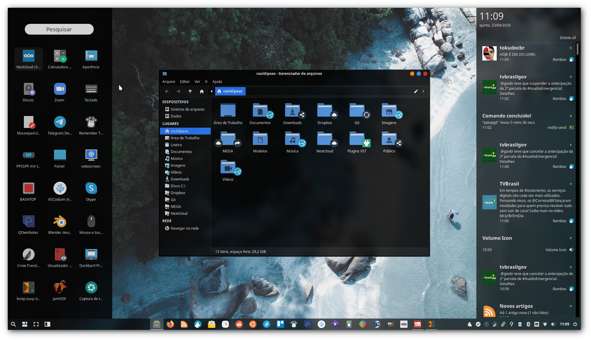

## Bem vindo!

Esta documentação contém scripts de personalização otimizados para o <a href="https://xubuntu.org" target="_blank"><strong>Xubuntu</strong></a> <a href="https://xubuntu.org/release/20-04/" target="_blank"><strong>20.04</strong></a>.

Saiba mais sobre os scripts através das postagens <a href="https://rauldipeas.github.io/blog" target="_blank"><strong>neste blog</strong></a>.

 

## Instalação

<strong>Você pode seguir a ordem recomendada de execução dos scripts, através do arquivo de <a href="postinst.md">pós instalação</a></strong>.

Para uma execução correta dos scripts, você deve copiar e colar uma linha por vez no terminal, para poder acompanhar detalhadamente o processo, dessa forma, qualquer tipo de problema pode ser detectado com maior facilidade.

Porém, se você quiser rodar de forma automatizada, pode instalar o <a href="bashrun.md"><strong>Bashrun</strong></a>, que permite a execução dos scripts ao clicar no botão <em><strong>Run</strong></em>.

Para atualizar os arquivos de configuração do usuário, execute os comandos indicados <a href="scripts/update-settings.md"><strong>aqui</strong></a>.

## Envolva-se

Crie um <a href="https://github.com/rauldipeas/xfscripts" target="_blank"><em><strong>fork</strong></em></a> e envie um <em><strong>pull-request</strong></em> com as suas sugestões de melhorias para este repositório, elas são muito bem vindas!

Acompanhe as atualizações do projeto através do canal no <a href="https://t.me/s/xfscripts" target="_blank"><strong>Telegram</strong></a> e do <a href="https://mastodon.social/@raul_dipeas" target="_blank" rel="me"><strong>Mastodon</strong></a>.

Acesse o servidor <a href="https://discord.gg/bEVNHfg" target="_blank"><strong>Linux Brasil</strong></a> no <a href="https://discord.gg/bEVNHfg" target="_blank"><strong>Discord</strong></a> e tire todas as suas dúvidas sobre Linux com os demais usuários.

<video width="100%" controls autoplay loop style="border-radius: 10px;">
  <source src="videos/xfscripts.mp4" type="video/mp4">
</video>

<!-- Load Facebook SDK for JavaScript -->
<!--

-->

<!-- Your customer chat code -->
<!--

-->

<!---->