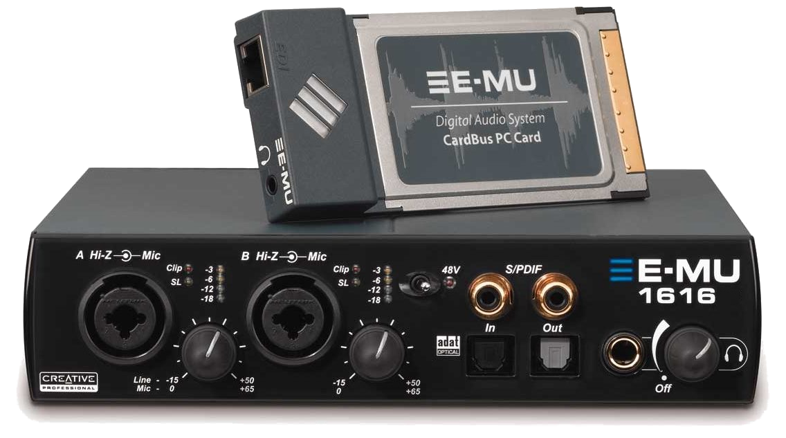

# ALSA firmware (E-MU 1616)
```bash
wget -c https://www.alsa-project.org/files/pub/firmware/alsa-firmware-1.2.1.tar.bz2 #update-link
tar -xvf alsa-firmware-*.tar.bz2
rm -rfv alsa-firmware-*.tar.bz2
cd alsa-firmware-*
aptinst -y build-essential
./configure --prefix=/usr
sudo make install
cd ..
rm -rfv alsa-firmware-*
```
[](br:alsa-firmware)

