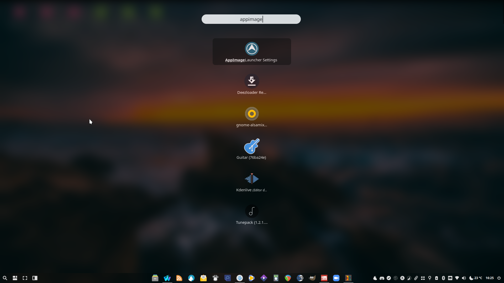

# AppImageLauncher
```bash
sudo add-apt-repository -y ppa:appimagelauncher-team/stable
aptinst -y appimagelauncher
echo "[AppImageLauncher]
ask_to_move=true
destination=$HOME/.local/bin
enable_daemon=true

[appimagelauncherd]
%23%20additional_directories_to_watch=~/otherApplications:/even/more/applications
%23%20monitor_mounted_filesystems=false" > ~/.config/appimagelauncher.cfg
```
[](br:appimagelauncher)

