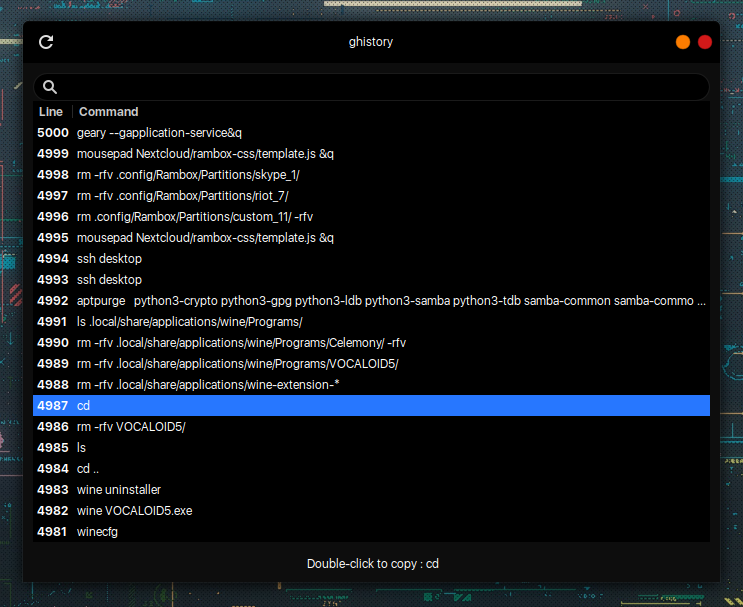

#Elementary OS AppCenter repo
```bash
echo 'deb http://packages.elementary.io/appcenter bionic main' | sudo tee /etc/apt/sources.list.d/appcenter.list
wget -O- http://packages.elementary.io/key.asc | gpg --dearmor | sudo tee /etc/apt/trusted.gpg.d/appcenter.gpg
aptupd
```
[](br:eos-appcenter-repo)

#### [AppCenter](https://appcenter.elementary.io/)


#### Webpin
```bash
aptinst -y com.github.artemanufrij.webpin
```


#### ghistory
```bash
aptinst -y com.github.padjis.ghistory
```
