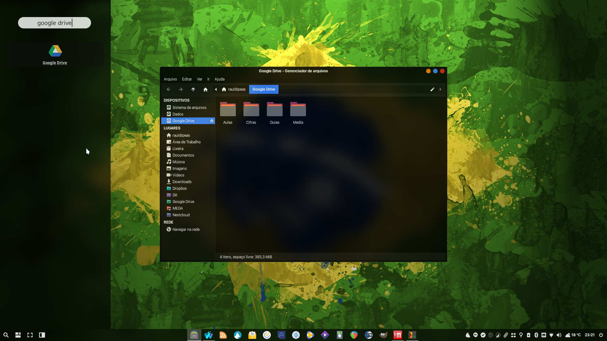

# Google Drive
```bash
sudo add-apt-repository -y ppa:alessandro-strada/ppa
aptinst -y google-drive-ocamlfuse
mkdir -pv ~/Google\ Drive
sudo mkdir -pv /usr/local/bin
sudo wget -O /usr/share/applications/google-drive.desktop http://my.opendesktop.org/s/L234JfnxHwZRSML/download #update-link
gef http://my.opendesktop.org/s/F2bd4As8LKgMcEL/download /usr/local/bin/google-drive.sh #update-link
google-drive-ocamlfuse ~/Google\ Drive
```
[](br:google-drive)

