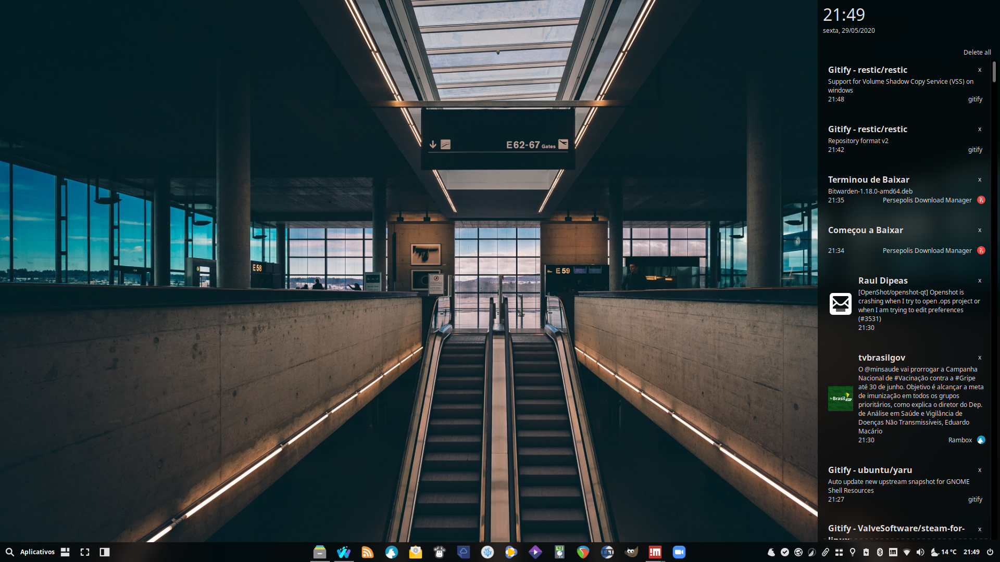

# Linux notification center
```bash
gef https://github.com/phuhl/linux_notification_center/releases/download/1.7.2/deadd-notification-center /usr/local/bin/deadd-notification-center #update-link
sudo chmod -x -v /usr/lib/x86_64-linux-gnu/xfce4/notifyd/xfce4-notifyd
mkdir -pv ~/.config/autostart ~/.config/deadd
wget -O ~/.config/autostart/linux-notification-center-start.desktop http://my.opendesktop.org/s/7cMHm7f5XtJbcRq/download #update-link
wget -O ~/.config/deadd/deadd.conf http://my.opendesktop.org/s/RQk9oJDzgrAk7RZ/download #update-link
xfconf-query -c xfce4-keyboard-shortcuts -np /commands/custom/"<Super>"n -s 'sh -c "kill -s USR1 $(pidof deadd-notification-center)"' -n -t string
```
[](br:linux-notification-center)

