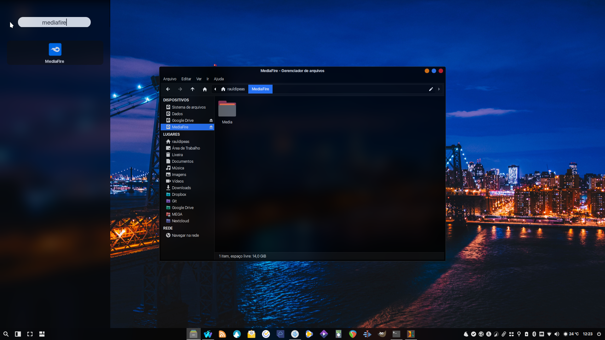

# MediaFire
```bash
sudo add-apt-repository -yn ppa:xapienz/curl34
echo '# Curl 3 and 4
Package: *
Pin: release o=LP-PPA-xapienz-curl34
Pin-Priority: 1000' | sudo tee /etc/apt/preferences.d/curl34
aptupd
sudo apt dist-upgrade -y
wget -O libssl1.deb http://my.opendesktop.org/s/qtraPxfsAgRLW5d/download #update-link
wget -O mediafire.deb http://my.opendesktop.org/s/DXb4BS7f49DJwgM/download #update-link
aptinst -y ./libssl1.deb ./mediafire.deb
rm -rfv libssl1.deb mediafire.deb
mkdir -pv ~/MediaFire ~/.config/mediafire-fuse
echo '--username foo@bar.com
--password secret' > ~/.config/mediafire-fuse/config
sudo mkdir -pv /usr/local/bin
sudo wget -O /usr/share/applications/mediafire.desktop http://my.opendesktop.org/s/BnW8qPcTx789MHR/download #update-link
sudo wget -O /usr/share/pixmaps/mediafire.png http://my.opendesktop.org/s/gBok2qi752SSx32/download #update-link
gef http://my.opendesktop.org/s/JB9ygn3SHW2JSdM/download /usr/local/bin/mediafire.sh #update-link
```
[](br:mediafire)

#### _Adicione as suas informações de login no arquivo:_ `~/.config/mediafire-fuse/config`

