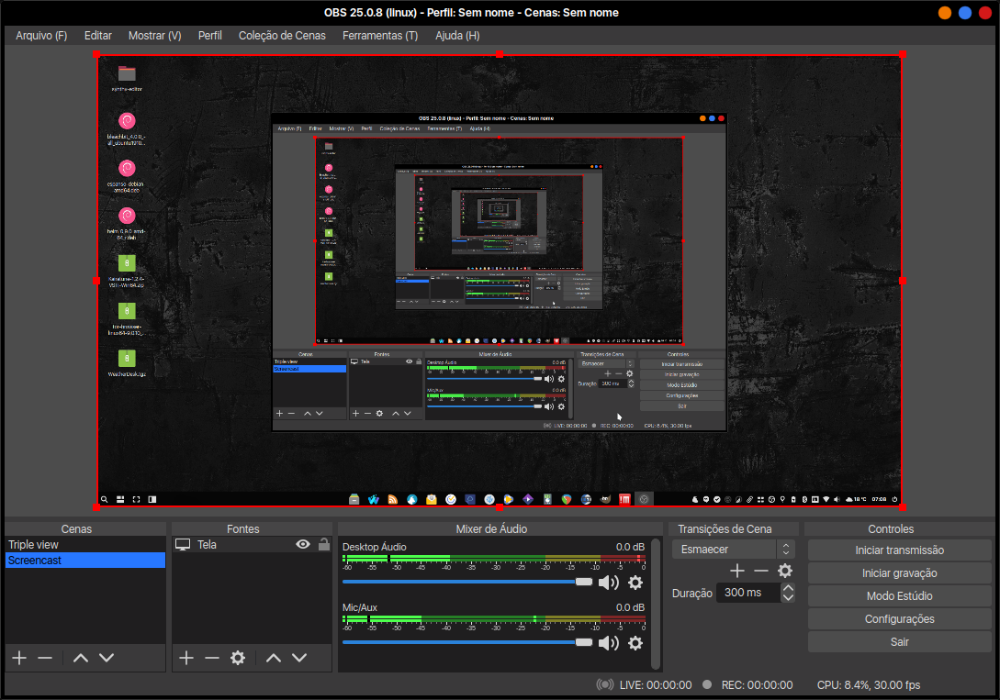

# OBS Studio
```bash
sudo add-apt-repository -y ppa:obsproject/obs-studio
aptinst -y adb obs-studio
mkdir -pv ~/.config/obs-studio/plugins
wget https://github.com/bazukas/obs-linuxbrowser/releases/download/0.6.1/linuxbrowser0.6.1-obs23.0.2-64bit.tgz
tar -xvzf linuxbrowser0.6.1-obs23.0.2-64bit.tgz -C ~/.config/obs-studio/plugins
wget https://files.dev47apps.net/linux/droidcam_latest.zip
unzip droidcam_latest.zip -d droidcam
cd droidcam
sudo ./install
cd ..
sudo rm -rfv droidcam droidcam_latest.zip
wget -O /usr/share/applications/droidcam.desktop http://cloud.opendesktop.org/s/3iyg4oJprZzWyWp/download
```
[](br:obs-studio)

<a href="https://restream.io" target="_blank"><strong>Restream</strong></a>

