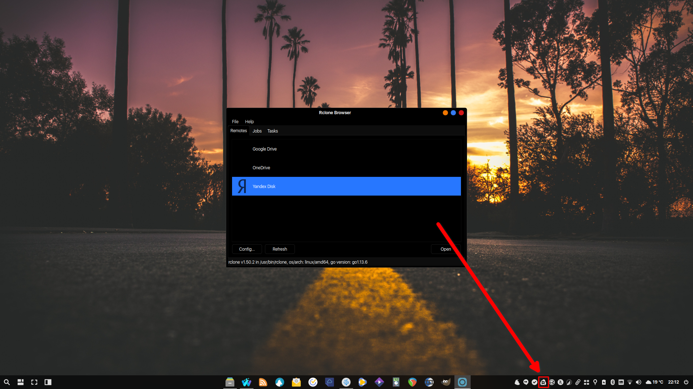

# RClone
```bash
wget https://github.com/dimitrov-adrian/RcloneTray/releases/download/v1.0.0/rclonetray_1.0.0_amd64.deb
aptinst -y rclone-browser ./rclonetray*.deb
rm -rfv rclonetray*.deb
```
[](br:rclone)

