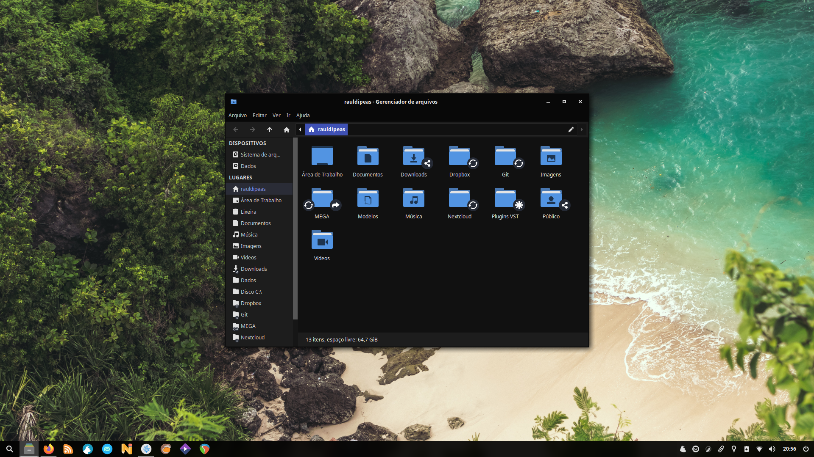

# Temas
```bash
sudo add-apt-repository -yn ppa:papirus/hardcode-tray
sudo add-apt-repository -yn ppa:papirus/papirus-dev
sudo add-apt-repository -yn ppa:tista/plata-theme
sudo add-apt-repository -y ppa:daniruiz/flat-remix
aptinst -y breeze-cursor-theme flat-remix-gtk hardcode-tray papirus-icon-theme plata-theme plymouth-theme-spinner qt5ct qt5-style-plugins
sudo sed -i 's/Icon\[pt_BR\]/#Icon\[pt_BR\]/g' /usr/share/applications/mate-calc.desktop
wget -O mousepad.dconf http://my.opendesktop.org/s/St7tgafok4Nr5q4/download
wget https://github.com/supermarin/YosemiteSanFranciscoFont/archive/master.zip
unzip master.zip
sudo mkdir -pv /usr/share/fonts/YosemiteSanFranciscoFont/
sudo mv YosemiteSanFranciscoFont-master/*.ttf /usr/share/fonts/YosemiteSanFranciscoFont/
fc-cache -f -v
rm -rfv master.zip YosemiteSanFranciscoFont-master/
dconf load /org/xfce/mousepad/ < mousepad.dconf
rm -rfv mousepad.dconf
xfconf-query -c thunar -np /last-location-bar -t string -s ThunarLocationButtons
xfconf-query -c thunar -np /last-window-height -t int -s 586
xfconf-query -c thunar -np /last-window-width -t int -s 900
xfconf-query -c xfce4-appfinder -np /always-center -t bool -s true
xfconf-query -c xfce4-appfinder -np /category-icon-size -t int -s 2
xfconf-query -c xfce4-appfinder -np /icon-view -t bool -s true
xfconf-query -c xfce4-appfinder -np /item-icon-size -t int -s 4
xfconf-query -c xfce4-appfinder -np /last/window-height -t int -s 5000
xfconf-query -c xfce4-appfinder -np /last/window-width -t int -s 5000
xfconf-query -c xfce4-desktop -np /desktop-icons/file-icons/show-filesystem -t bool -s false
xfconf-query -c xfce4-desktop -np /desktop-icons/file-icons/show-home -t bool -s false
xfconf-query -c xfce4-desktop -np /desktop-icons/file-icons/show-removable -t bool -s false
xfconf-query -c xfce4-desktop -np /desktop-icons/file-icons/show-trash -t bool -s false
xfconf-query -c xfce4-notifyd -np /theme -t string -s Flat-Remix-GTK-Blue-Darkest-Solid-NoBorder
xfconf-query -c xfce4-power-manager -np /xfce4-power-manager/show-tray-icon -t bool -s true
xfconf-query -c xfwm4 -np /general/button_layout -t string -s "|HMC"
xfconf-query -c xfwm4 -np /general/cycle_draw_frame -t bool -s false
xfconf-query -c xfwm4 -np /general/title_font -t string -s SFNS Display Bold 9
xfconf-query -c xfwm4 -np /general/placement_ratio -t int -s 100
xfconf-query -c xfwm4 -np /general/easy_click -t string -s Super
xfconf-query -c xfwm4 -np /general/theme -s Flat-Remix-GTK-Blue-Darkest-Solid-NoBorder
xfconf-query -c xfwm4 -np /general/workspace_count -t int -s 1
xfconf-query -c xsettings -np /Gtk/CursorThemeName -s Breeze_Snow
xfconf-query -c xsettings -np /Gtk/FontName -s 'SFNS Display 9'
xfconf-query -c xsettings -np /Gtk/MonospaceFontName -s 'Monaco 10'
xfconf-query -c xsettings -np /Net/IconThemeName -s Papirus-Dark
xfconf-query -c xsettings -np /Net/ThemeName -s Flat-Remix-GTK-Blue-Darkest-Solid-NoBorder
sudo update-alternatives --set x-cursor-theme /etc/X11/cursors/Breeze_Snow.theme
sudo update-alternatives --set default.plymouth /usr/share/plymouth/themes/bgrt/bgrt.plymouth
sed -i 's/elementary/colibre/g' ~/.config/libreoffice/4/user/registrymodifications.xcu
echo '{
    "blacklist": ["steam"],
    "icons": {
        "size": 24
    },
    "backup_ignore": true
}' > ~/.config/hardcode-tray.json
sudo hardcode-tray --apply
sudo sed -i 's/export QT/#export QT/g' /etc/X11/Xsession.d/56xubuntu-session
mkdir -pv ~/.config/qt5ct
echo '[Appearance]
icon_theme=Papirus-Dark
style=gtk2

[Fonts]
fixed=@Variant(\0\0\0@\0\0\0\f\0M\0o\0n\0\x61\0\x63\0o@$\0\0\0\0\0\0\xff\xff\xff\xff\x5\x1\0\x32\x10)
general=@Variant(\0\0\0@\0\0\0\x18\0S\0\x46\0N\0S\0 \0\x44\0i\0s\0p\0l\0\x61\0y@\"\0\0\0\0\0\0\xff\xff\xff\xff\x5\x1\0\x32\x10)' > ~/.config/qt5ct/qt5ct.conf
echo '[greeter]
background = /usr/share/xfce4/backdrops/xubuntu-zesty.png
theme-name = Flat-Remix-GTK-Blue-Darkest-Solid-NoBorder
icon-theme-name = Papirus-Dark
font-name = SFNS Display 9' | sudo tee /etc/lightdm/lightdm-gtk-greeter.conf
sudo wget -O /usr/share/plymouth/themes/xubuntu-logo/logo.png http://my.opendesktop.org/s/7cJJBjzN3Zdi8zr/download #update-link
sudo update-initramfs -u -k all
```
[](br:style)

