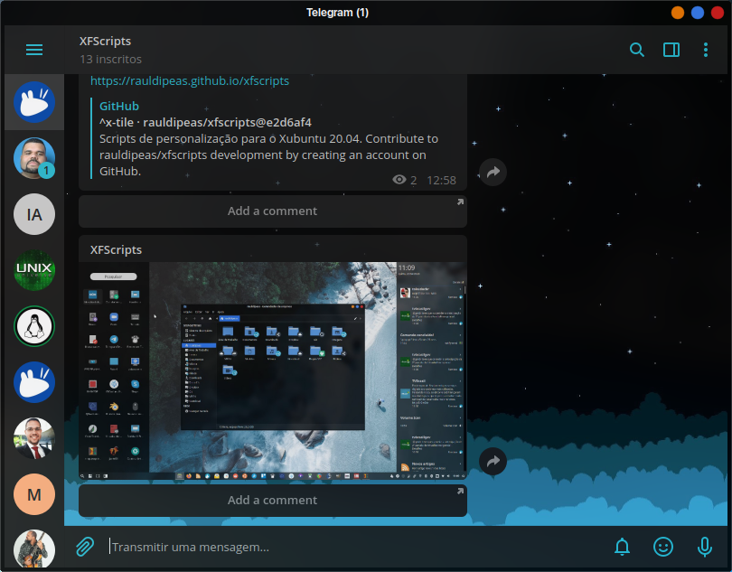

# Telegram
```bash
wget -O telegram.tar.xz https://telegram.org/dl/desktop/linux
tar -xvf telegram.tar.xz -C $HOME/.local/share/
rm -rfv telegram.tar.xz
$HOME/.local/share/Telegram/Telegram 2&1> /dev/null
```
[](br:telegram)

